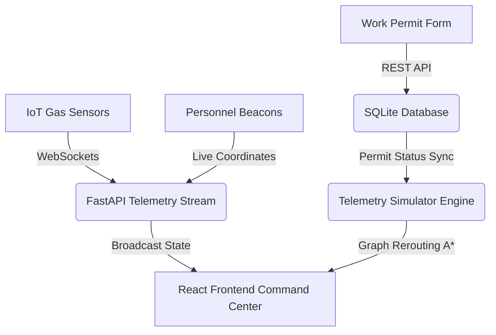

# 🛡️ SafeGuard: Event-Driven Industrial Safety Platform

> **"Intelligence that prevents the unthinkable."**
> 
> *A state-of-the-art, real-time command center combining event-driven IoT telemetry, compound risk fusion engines, and dynamic graph-theoretic evacuation routing (A\*) to protect personnel in high-hazard industrial environments.*

---

## ⚡ The Vision

In modern industrial facilities (chemical plants, refineries, factories), safety systems operate in silos. Traditional evacuation plans rely on static emergency signs, ignoring active floor conditions. 

**SafeGuard** changes this paradigm by introducing **Dynamic Risk-Aware Evacuation Routing**:
- **The Compound Risk Problem:** A gas level of 10% is sub-critical on its own. A welding torch permit (Hot Work) is safe on its own. However, **gas leakage + an active welding permit** in the same sector constitutes a high-risk compound hazard.
- **The SafeGuard Solution:** SafeGuard fuses live IoT sensor telemetry with digital work permit registries in real-time. The moment a compound hazard is detected, the platform automatically triggers an evacuation protocol, recalculating personnel escape paths using A* routing to bypass danger zones.

---

## 🛰️ System Architecture



SafeGuard is built as a split-architecture, high-velocity streaming system:

1. **The Core Engine (Python Backend):**
   - **FastAPI / WebSockets:** Provides lightweight, event-driven pipes to push real-time sensor updates and worker coordinate frames to UI clients.
   - **NetworkX graph model:** Represents the factory floor as nodes (entrances, assembly lines, gas depots, exits) and weighted edges (corridors).
   - **Dynamic A\* Pathfinding:** Implements pathfinding over the layout graph. If a hazard occurs, edges incident to the danger zone are dynamically penalized (infinite weights), forcing A* to divert routes through alternative corridors.
   - **SQLite Database (SQLAlchemy):** Holds static historical permit clearances and incident logs to avoid in-memory database locks.

2. **The Command Center (React Frontend):**
   - **Vite React 18 & Zustand:** Powering a responsive, lightweight state management layer with auto-reconnecting WebSocket loops.
   - **Tailwind CSS & Lucide Icons:** Delivering a high-end, military-grade dark mode command console dashboard (comparable to Datadog/Palantir aesthetics).
   - **Native SVG Layout Schematic:** Renders the floor layout coordinates dynamically. Workers slide smoothly across coordinates via hardware-accelerated CSS animations. Glowing, animated polylines trace safe evacuation routes in real-time.

---

## 🛠️ Tech Stack & Architecture

### Backend (Python Engine)
* **FastAPI & WebSockets:** Powers the real-time, event-driven architecture. WebSockets establish a persistent, bidirectional channel to broadcast live sensor readings and personnel positions immediately.
* **NetworkX:** A high-performance package used for graph network manipulation. It models the physical layout of the factory as a graph ($G$) consisting of nodes (work zones, exits) and edges (corridors). SafeGuard leverages its A* pathfinding algorithms with dynamic edge weighting to calculate escape paths.
* **SQLAlchemy & SQLite:** Handles static persistence for work permits history and incident reports. Live telemetry bypasses this DB layer entirely to prevent SQLite database write locks during high-frequency events.

### Frontend (React Command Console)
* **React 18 & Vite:** Offers a fast, modern UI render cycle and instant hot module reloading (HMR) for development.
* **Zustand:** A lightweight state management framework that manages the WebSocket lifecycle and maintains client-side consistency. It utilizes shallow comparisons to prevent unnecessary re-renders during high-velocity updates.
* **Native HTML5 SVG:** Renders the layout map. Instead of standard visual map libraries (like Leaflet or Mapbox), using native SVG allows absolute pixel plotting ($X, Y$), customized glowing node layers, and vector polylines.
* **Tailwind CSS:** Applies a dense, dark-mode military/industrial theme (Palantir/Datadog aesthetic) with smooth CSS transitions for moving personnel.

---

## 🔄 System Flow (How Everything Works Together)

```
[1. Environmental Change] ➔ [2. Compound Risk Fusion] ➔ [3. Dynamic Pathing (A*)] ➔ [4. WS Broadcast] ➔ [5. Visual Command Console]
```

1. **Environment Telemetry & Permit Changes:** The backend runs an asynchronous background task simulating fluctuating gas levels in the facility (e.g. at the Gas Storage Depot). Simultaneously, a supervisor issues a **Hot Work Permit** (e.g., welding) in the same sector via the frontend REST API.
2. **Compound Risk Fusion Engine:** The simulator continuously cross-checks current readings and clearances against safety rules. If **Gas level > 12.0%** **AND** there is an **Active Hot Work Permit**, the engine triggers a state transition from `NORMAL` to `EVACUATING` and writes a safety violation to SQLite.
3. **Dynamic Route Penalization (A* Recalculation):** Once in the `EVACUATING` state, the backend clones the factory graph and dynamically assigns **infinite weights (999999.0)** to all corridors connected to the danger node, making them impassable. For each worker on the floor, the engine runs A* pathfinding from their current node to the nearest exit node. Because the hazard edges are penalized, A* automatically reroutes their paths through alternative, safe corridors.
4. **WebSocket Broadcast:** The updated state—containing the global system status (`critical_alert`), live gas metrics, worker animated paths, and the dynamic layout nodes—is serialized into JSON. The connection manager broadcasts this payload to all active client WebSocket channels.
5. **Visual Dashboard Render:** Zustand receives the JSON stream, updates state variables, and triggers component rerendering. The [FloorLayoutSchematic](file:///c:/Users/Navni%20Mahendroo/Desktop/PROJECTS/SafeGuard/frontend/src/FloorLayoutSchematic.jsx) draws a thick, animated glowing green polyline displaying the safe escape route. Personnel markers glide smoothly across the SVG floor toward exits using CSS coordinate transitions.

---

## 🚀 Key Features

* **Cinematic Welcome Experience:** A premium landing interface displaying dynamic radar pulses, neon grids, and cyan particle backdrops.
* **Live Factory Topology Schematic:** Fully interactive, responsive SVG graph rendering corridors, entrances, and exits directly from backend datasets.
* **Micro-Animated Trackers:** Active workers are rendered as glowing locator beacons that glide smoothly along corridors using CSS coordinate interpolations.
* **Digital Work Permit Registry:** Form clearances allowing control operators to issue or revoke thermal clearances (Hot Work) dynamically.
* **Environmental Dials:** Displays live gas percentages which transition to flashing alert cards immediately if limits are breached.
* **Incidents Ledger:** Chronological records documenting peak gas leakage levels, logs, timestamps, and target evacuees.

---

## 🗂️ Project File Structure

```bash
SafeGuard/
├── main.py                 # FastAPI backend server & A* simulation loop
├── requirements.txt        # Python backend dependencies
├── safeguard.db            # SQLite local logging database
├── README.md               # Documentation
└── frontend/               # React client workspace
    ├── package.json        # Frontend npm packages
    ├── tailwind.config.js  # Tailwind CSS theme extensions
    ├── postcss.config.js   # CSS compiler setup
    ├── index.html          # Web page root template
    └── src/
        ├── App.jsx         # View switcher & Landing hero page
        ├── store.js        # Zustand websocket store & REST services
        ├── CommandCenter.js # Main grid console panel layout
        ├── FloorLayoutSchematic.js # SVG floor plan rendering
        └── index.css       # Global styles & Tailwind directives
```

---

## ⚙️ Installation & Setup

### Prerequisites
* Python 3.10 or higher
* Node.js v18 or higher
* npm or yarn

---

### Step 1: Run the Backend Server

1. Navigate to the root directory:
   ```bash
   cd SafeGuard
   ```

2. Create a virtual environment and activate it:
   ```bash
   python -m venv venv
   # On Windows (PowerShell):
   .\venv\Scripts\Activate.ps1
   # On macOS/Linux:
   source venv/bin/activate
   ```

3. Install required libraries:
   ```bash
   pip install -r requirements.txt
   ```

4. Start the FastAPI uvicorn server:
   ```bash
   uvicorn main:app --reload
   ```
   *The API will start on **http://127.0.0.1:8000**.*
   *You can access the Swagger docs at **http://127.0.0.1:8000/docs**.*

---

### Step 2: Run the React Frontend

1. Navigate to the `frontend/` directory:
   ```bash
   cd frontend
   ```

2. Install npm packages:
   ```bash
   npm install
   ```

3. Launch the Vite dev server:
   ```bash
   npm run dev
   ```
   *Open **http://localhost:5173** in your web browser to enter the Command Center.*

---

## 🎮 How to Test the Simulator

1. **Normal State:** Upon launching, gas levels hover at safe zones (< 6.0%). Workers are mapped as blue tracking beacons moving randomly between assembly lines and exits.
2. **Clearance Issuance:** In the *Work Permit Controller* panel, select **Gas Storage Zone (Zone 4)** and click **Authorize Clearance** to issue a Hot Work permit. The zone will glow amber on the map.
3. **Compound Risk Trigger:** The telemetry simulator automatically drifts the gas level at Zone 4. Once it exceeds **12.0%** during the active permit, the system enters the **EVACUATING** state:
   - The dashboard flashes with rose-colored alert banners.
   - The Gas Storage zone on the map glows red.
   - The system immediately reroutes workers away from Zone 4.
   - A thick, animated glowing green SVG path lights up on the schematic, highlighting the optimal escape path calculated by the A* algorithm.
4. **Resolution:** Close/revoke the permit or wait for gas levels to drop below 10.0%. The command console will return to a safe green status and normal operations resume.
